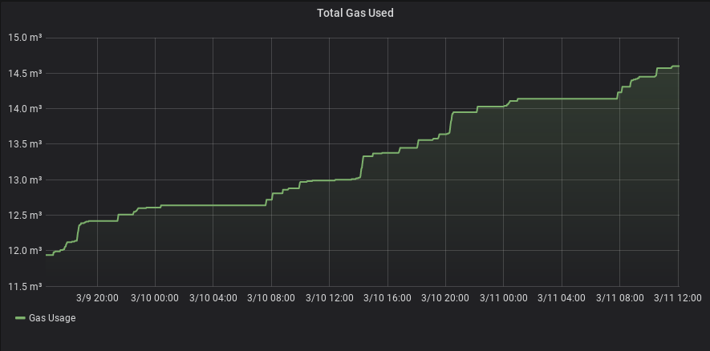
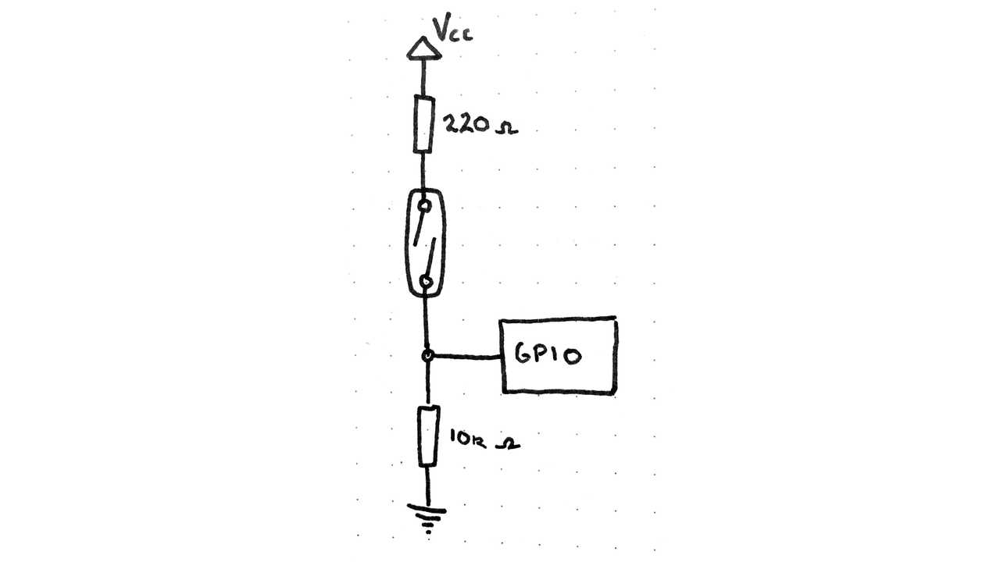

> Monitor a Gas or Water Odometer with a Raspberry Pi

## What is this?

It is a small program, written in Go that is designed to run on a Raspberry Pi.

It starts a web server on port 8080 that serves up Prometheus metrics at
`/metrics`. You can then use Prometheus & Grafana to track your water or gas
usage.



## How do I use this?

You will need to connect [GPIO Pin 26](https://pinout.xyz/pinout/pin37_gpio26)
a [reed switch](https://en.wikipedia.org/wiki/Reed_switch) to the 3v pin, as
well as a pull-down resistor to ground.



Then place the reed switch below the "fastest" barrel of your gas/water
odometer. On most meters, this barrel has a magnet embedded inside it that will
trigger the reed switch to close and complete the circuit.


## Deploy To Balena

This project is designed to be deployed with [Balena](http://balena.io/).

They have [fantastic
documentation](https://www.balena.io/docs/learn/getting-started/raspberry-pi2/go/)
for helping you get started.

Sign up for a free account, create a project, install their software on your Pi
and then upload this project.

```bash
git clone https://github.com/stayradiated/pi-odometer
cd pi-odometer
balena push <your-project-name>
```

## Prometheus Config

I am using Docker Compose to launch Prometheus & Grafana.

### `docker-compose.yml`

```yaml
version: "3"
services:
  prom:
    image: prom/prometheus
    volumes:
     - ./prometheus.yml:/etc/prometheus/prometheus.yml
    command: "--config.file=/etc/prometheus/prometheus.yml --storage.tsdb.path=/prometheus"
    ports:
     - 9090:9090
  grafana:
    image: grafana/grafana
    ports:
     - "3000:3000"
    depends_on:
      - prom
```

### `prometheus.yml`

```yaml
scrape_configs:
  - job_name: 'pi-odometer'
    scrape_interval: 5s
    static_configs:
      - targets: ['192.168.0.14'] # replace with the IP address of your Pi
```
